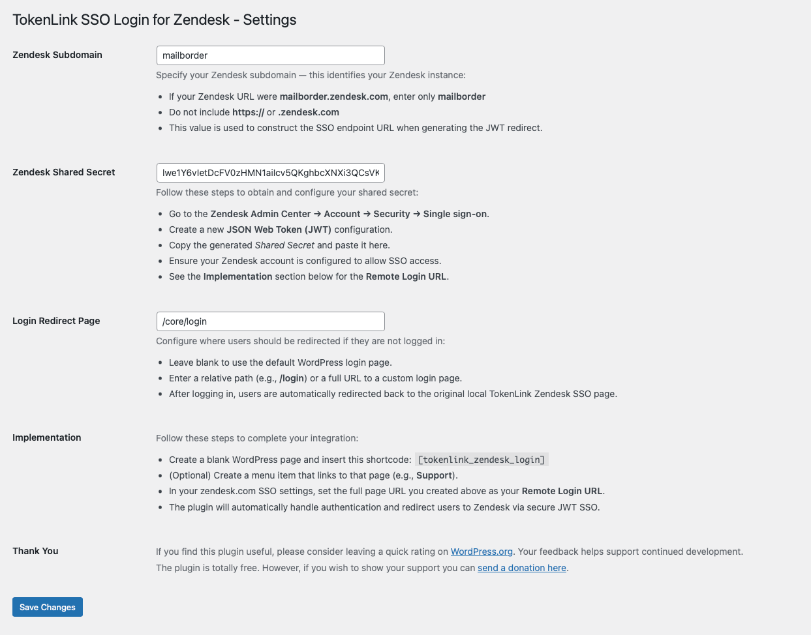
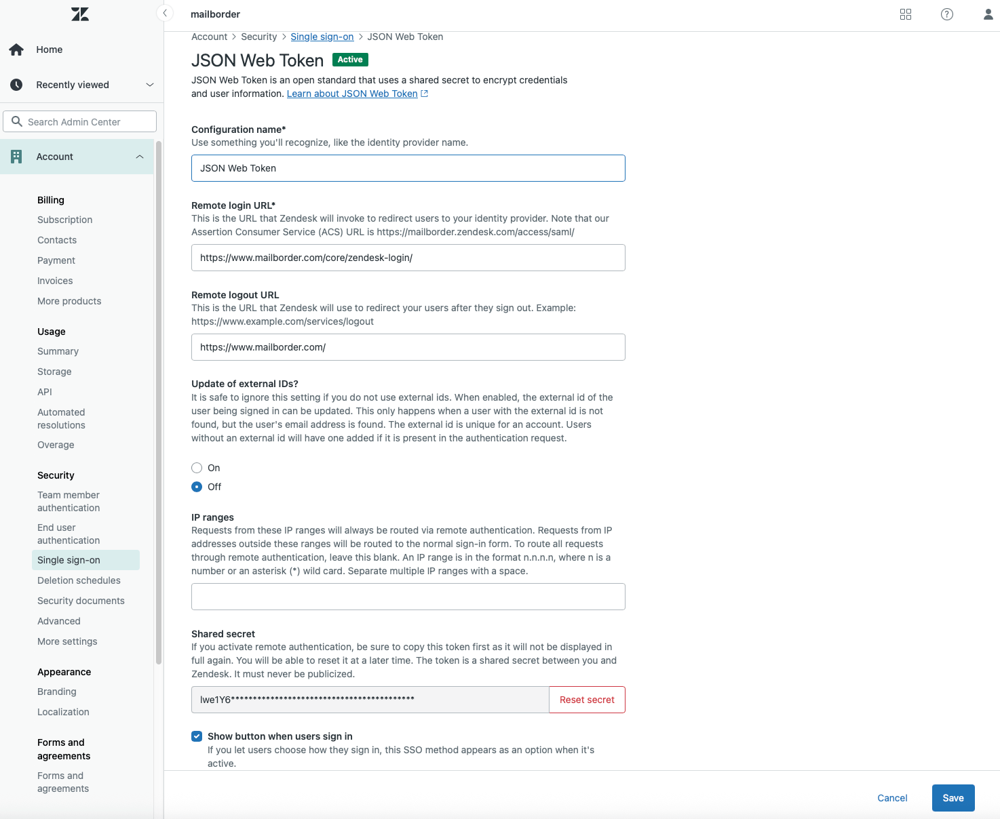
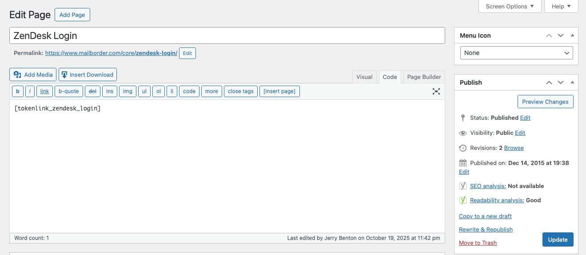

# TokenLink SSO Login for Zendesk (by Mailborder)

**Contributors:** [Mailborder](https://profiles.wordpress.org/mailborder)  
**Donate link:** [Stripe](https://donate.stripe.com/14AdRa6XJ1Xn8yT8KObfO00  )  
**Tags:** zendesk, sso, jwt, single sign on, login  
**Requires at least:** WordPress 5.5  
**Tested up to:** 6.8  
**Requires PHP:** 7.4  
**Stable tag:** 1.0.6  
**License:** GPLv3 or later  
**License URI:** [https://www.gnu.org/licenses/gpl-3.0.html](https://www.gnu.org/licenses/gpl-3.0.html)

Provides secure JWT-based single sign-on (SSO) between WordPress and Zendesk without requiring third-party dependencies.

---

## 🧩 Description

**TokenLink SSO Login for Zendesk** allows WordPress administrators to provide seamless, secure single sign-on access to Zendesk using JWT authentication.
  
It uses the official [Firebase PHP-JWT](https://github.com/firebase/php-jwt) library (BSD 3-Clause licensed, included manually for convenience).

Developed by **Jerry Benton**, creator of *Mailborder* and *MailScanner v5*.

---

## ⚙️ Installation

You can install this plugin in three ways:

### 1. From the WordPress Plugin Directory (Recommended)
1. Go to **Plugins → Add New** in your WordPress dashboard.  
2. Search for **TokenLink SSO Login for Zendesk**.  
3. Click **Install Now**, then **Activate**.

### 2. Upload via ZIP File
1. Download the ZIP from [Github](https://github.com/jcbenton/tokenlink-sso-login-for-zendesk) or from WordPress.org.  
2. Go to **Plugins → Add New → Upload Plugin**.  
3. Select the ZIP file, click **Install Now**, then **Activate Plugin**.

### 3. Manual Installation (FTP or File Manager)
1. Download and extract the plugin ZIP locally.  
2. Upload the extracted folder to `/wp-content/plugins/`.  
3. Activate it through the **Plugins** menu in WordPress.

---

## 🔧 Configuration
1. Navigate to **Settings → TokenLink - Zendesk**.
2. Enter your **Zendesk Subdomain** and **Shared Secret**.
3. Set a **Login Redirect Page** if you use a custom login URL.
4. Create a blank WordPress page and insert this shortcode: `[tokenlink_zendesk_login]`
5. (Optional) Create a menu item that links to that page. (e.g. a Support link)
6. Use that page’s URL as your **Remote Login URL** in the zendesk.com SSO settings.

The plugin will automatically handle authentication to Zendesk and redirect users to Zendesk via secure JWT SSO.

---

## Frequently Asked Questions

#### - Is this plugin free?  
Yes. 100% free. As in free beer. No pro version. No nagware. 

#### - Is this plugin lightweight?  
Yes. It loads ~40kb of code when it runs. 

#### - Does this plugin require any other plugin?  
No. This is a standalone plugin and does not depend on any other plugin.

#### - Does it work with modern Zendesk accounts?  
Yes. It implements the standard JWT-based SSO endpoint (`/access/jwt`).

#### - Is Composer required?  
No. The JWT library is bundled directly in the plugin for convenience.

#### - Does this plugin store any user data?  
No. It simply authenticates the current logged-in WordPress user and securely passes their name and email to Zendesk for SSO. No personal data is logged or retained by the plugin.

#### - Can I customize the login redirect page?  
Yes. You can set a custom login page under **Settings → Zendesk SSO → Login Redirect Page**.  
If left blank, it defaults to the standard WordPress login screen.

#### - Does this plugin support multisite installations?  
Yes. It can be network-activated or activated on individual subsites. Each site can have its own Zendesk configuration.

#### - Can this be used with caching or security plugins?  
Yes. It’s compatible with common caching and security plugins.  
If your caching plugin caches logged-in pages, exclude the page containing `[tokenlink_zendesk_login]` to ensure proper redirects.

#### - Will it conflict with existing SSO or login plugins?  
No, it runs independently. It only triggers when the `[tokenlink_zendesk_login]` shortcode is executed, so it won’t interfere with other authentication systems.

#### - Does this plugin work with Cloudflare or reverse proxies?  
Yes. As long as HTTPS and PHP sessions function normally, JWT SSO works over any proxy or CDN.

#### - I’m getting a 502 or redirect loop. What should I check?  
Verify your Zendesk subdomain and shared secret are correct, and that your Zendesk SSO settings point to your WordPress page URL containing `[tokenlink_zendesk_login]`.

## Donations
If you like the plugin, please consider [a donation](https://donate.stripe.com/14AdRa6XJ1Xn8yT8KObfO00) to help support development. 

## Changelog

### 1.0.6 — 2025-10-19
* Initial public release.
* Modernized JWT implementation (Firebase PHP-JWT).
* Added WordPress settings screen.
* Added `[tokenlink_zendesk_login]` shortcode.
* Updated JWT libraries to meet Wordpress PHPCS standards. 
* Added donation link to settings page. 
* Updated docs and version numbers.

### 🖼️ Screenshots in /assets

**1. Zendesk SSO Settings Page**

**2. Zendesk JWT Configuration in Zendesk**

**3. Example Shortcode Page**

### License

This plugin is licensed under the GPLv3 or later.  
It includes the Firebase PHP-JWT library, which is licensed under the BSD 3-Clause license.